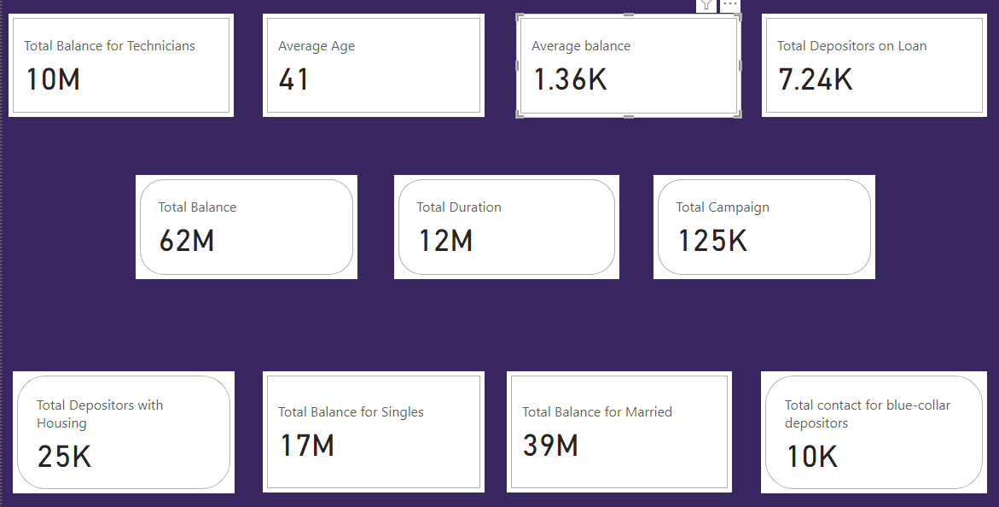
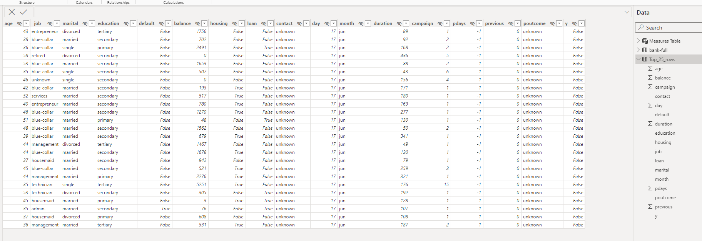
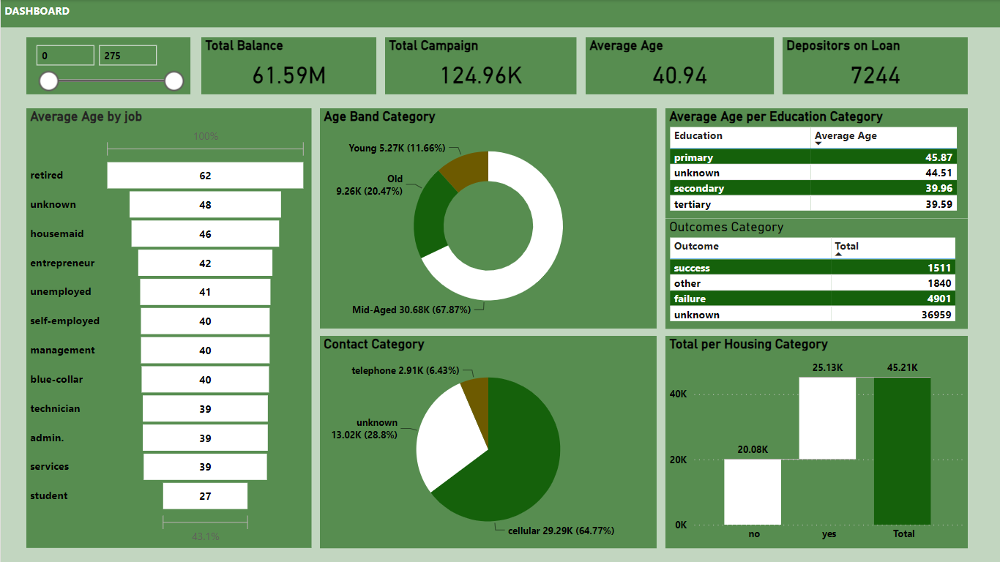
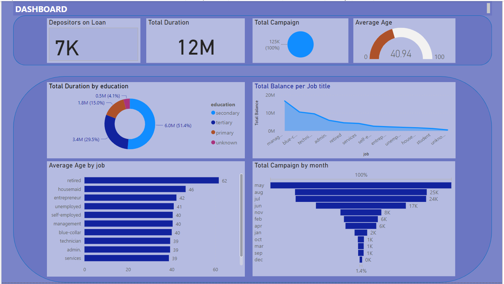
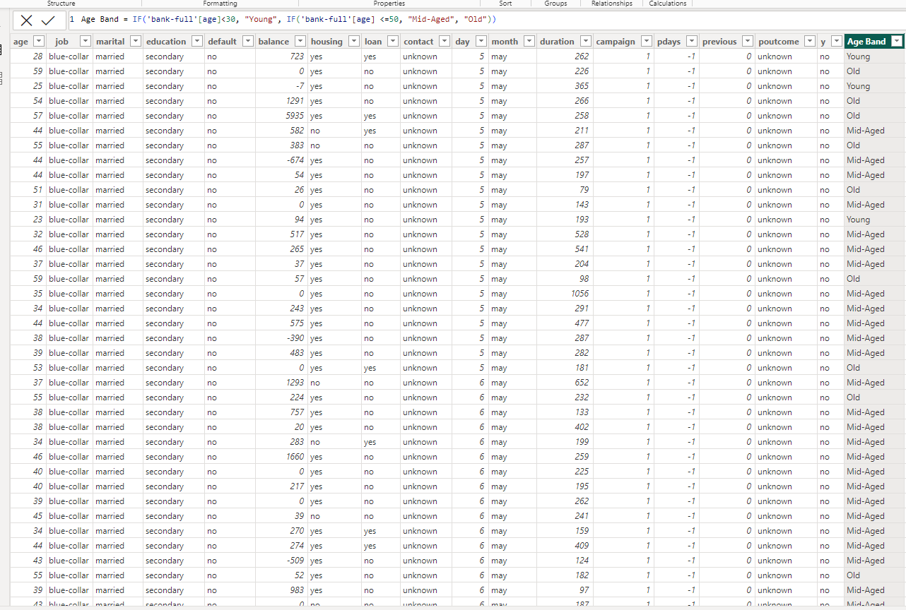
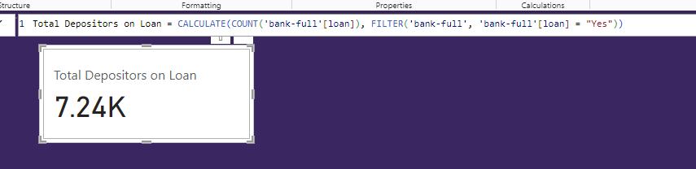

# Demographic Analysis of Northwind Traders Dataset Using Power BI
This project involves the examination and analysis of a dataset to demonstrate proficiency in Power BI and extract insights regarding the demographic, housing, and loan patterns of traders.

## Introduction:
Welcome to the 'Demographic-Analysis-of-Northwind-Traders-Dataset-Using-Power-BI" repository! 🚀

This project aims to showcase my skills in leveraging Power BI for comprehensive data analysis. Here, I've delved into a dataset to unravel insights into the diverse demographic, housing, and loan patterns of traders. Through this exploration, I showcase not only my technical proficiency in Power BI but also my ability to derive meaningful conclusions from intricate datasets.

Explore this repository to witness the journey of transforming raw data into actionable insights. From demographic trends to housing preferences and loan patterns, this project offers a comprehensive view of the multifaceted aspects of traders' behavior.

Feel free to delve into the code, visualizations, and findings. Your feedback is highly appreciated as I continue to refine and enhance my data analysis skills. Happy exploring! 📊🔍

## Data Sourcing/Dataset:
* This is a dummy dataset creayed to showcase Power BI proficiency.
* The dataset is titled "Bank-Full".
* It contains 45,211 rows and 17 columns.
* One additional column "Age Band" was added to answer a problem statement using the IF functionality.

## Power BI Concepts Demonstrated:
The following Power BI features were captured in this projects:

- DAX (Data Analysis Expression) measures
- Calculated columns
- Filters and page navigation
- Modelling
- IF, AVERAGE, SUM, FILTER, VALUES, COUNTA, CALCULATE Functions

##  Dynamic Data Analysis Expressions (DAX Measures):
The following DAX measures were created;

- Total Balance for Technicians
- Average Age
- Average Balance
- Total Depositors on Loan
- Total Balance
- Total Duration
- Total Campaign
- Total Depositors with Housing
- Total Balance for Singles
- Total Balance for Married
- Total Contact for Blue-Collar Depositors

## Tasks to be executed:
- Here is a list of tasks to be executed;
- These tasks aim to probe and answer questions to provide insights into the data.

   TASK 1                          |       TASK 2
   :-------------------------:|:---------------------------:
                    |    

   TASK 3                          |       TASK 4
   :-------------------------:|:---------------------------:
                    |    

 ## TASK 1 - Importing top 25 rows:
* Firstly, I imported the dataset to Microsoft SQL.
* Next, I wrote a code to return only the top 25 rows from the data set.

        SELECT TOP 25 *
        FROM bank-full;
  
* Then, I copied this code and proceeded to import the first 25 rows from my power BI desktop.
* I connected my power BI desktop to my SQL server and used the above code to import the data.
* The result can be seen below;
  

 ## TASK 2 - Project Task to uncover insights:
* I created several measures to answer key questions;
* What is the demographic of the traders/depositors?
* What percentage are young, old, and middle-aged?
* What is the average age of the traders categorized by their differnt jobs?
* How many traders are on loan?
* How many traders have housing and how many do not?
* What is the most used mode of contact?
* What is the average age per education category?
* How are the outcomes distributed?
* Do we have more success than failure?

 
 ## TASK 3 - Creating a dashboard for the dataset:
 - Here, I created a dashboard to reveal some insights into the dataset.
 - There are 7,241 traders/depositors on loan.
 - The average age of traders is 41.
 - The total duration is 12 million.
 - The total campaign is 125,000.
 - The month of May has the highest campaign.
 - The job with the most balance is Management.
 - The secondary eduaction category has the most duration.

 ## TASK 3 - Creating a calculated column and DAX measures:

 1. Average Age

        Average Age = AVERAGE('bank-full'[age])

 

 2. Age Band

        Age Band = IF('bank-full'[age]<30, "Young", IF('bank-full'[age] <=50, "Mid-Aged", "Old"))

 
 
 3. Total Balance for Technicians

        Total Balance for Technicians = CALCULATE(SUM('bank-full'[balance]), FILTER('bank-full', 'bank-full'[job] = "Technician"))

 
 
 4. Total Balance for Married

        Total Balance for Married = CALCULATE(SUM('bank-full'[balance]), FILTER('bank-full', 'bank-full'[marital] = "Married"))

 5. Total Balance for Singles

        Total Balance for Married = CALCULATE(SUM('bank-full'[balance]), FILTER('bank-full', 'bank-full'[marital] = "Married"))

 6. Depositors on Loan

         Total Depositors on Loan = CALCULATE(COUNT('bank-full'[loan]), FILTER('bank-full', 'bank-full'[loan] = "Yes"))

## Conclusion:
- This project not only served as a showcase for my adept Power BI skills but also served as a test for my prowess in uncovering valuable insights.
  
- A profound dive into the dataset allowed for the meticulous examination of various categories and demographics among traders, showcasing my ability to unearth nuanced patterns within complex datasets.

- Beyond the demonstration of technical skills, the insights gleaned from this project offer a valuable perspective, providing stakeholders with actionable information that goes beyond mere data analysis. The nuanced understanding of trader behaviors and demographics serves as a foundation for strategic decision-making.

- Leveraging the full spectrum of Power BI functionalities, including dynamic dashboards and interactive reports, this project underscores not only proficiency in data visualization but also the capability to create a compelling narrative through insightful storytelling. The utilization of advanced Power BI features adds an extra layer of sophistication to the analysis, enhancing the overall impact of the project.

- As this project evolves, it stands as a testament not just to data analysis competence but to a deep understanding of how Power BI can be wielded as a powerful tool for extracting, visualizing, and communicating meaningful insights. Your feedback is greatly appreciated as I continue to refine and expand my proficiency in the dynamic realm of Power BI. 📊💡
- Thank You 🤝
