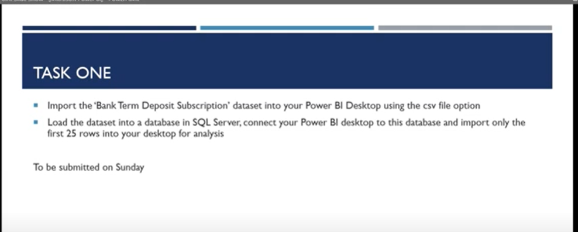
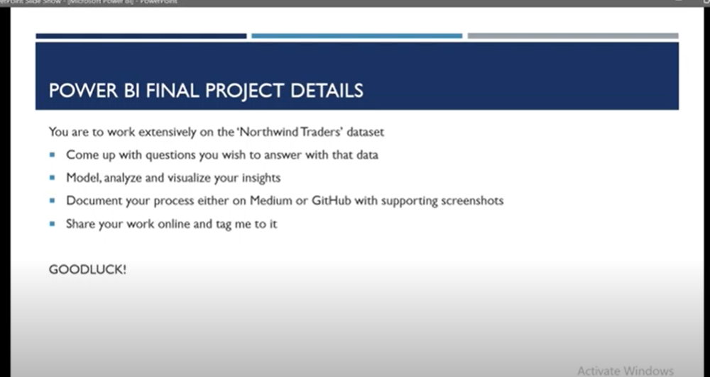
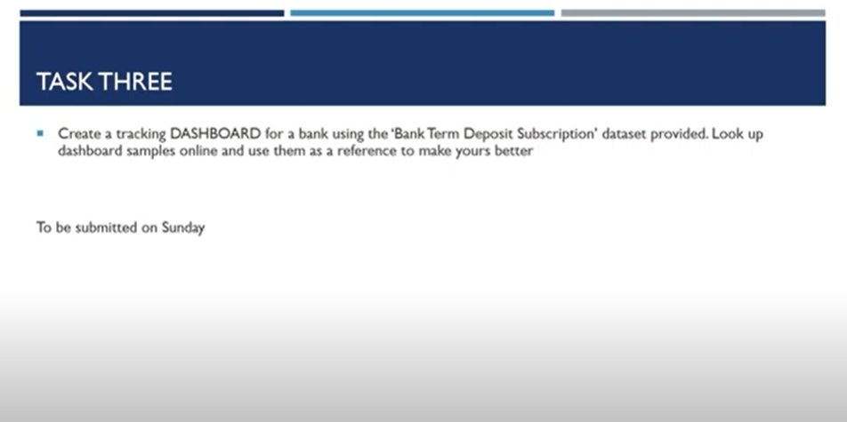
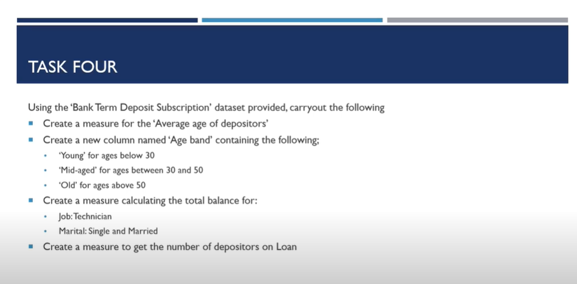
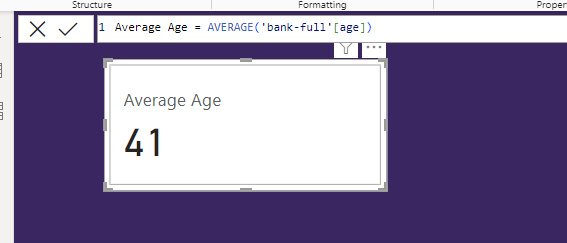
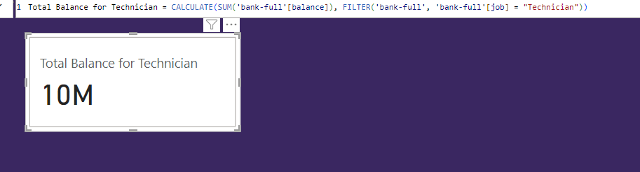
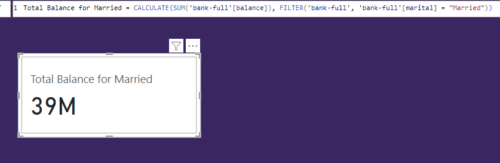
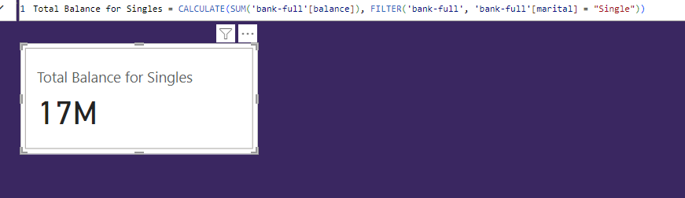

# Demographic-Analysis-of-Northwind-Traders-Dataset-Using-Power-BI
 This project involves the examination and analysis of a dataset to demonstrate proficiency in Power BI and extract insights regarding the demographic, housing, and loan patterns of traders.

## Introduction:
Welcome to the 'Demographic-Analysis-of-Northwind-Traders-Dataset-Using-Power-BI" repository! 🚀

This project aims to showcase my skills in leveraging Power BI for comprehensive data analysis. Here, I've delved into a dataset to unravel insights into the diverse demographic, housing, and loan patterns of traders. Through this exploration, I showcase not only my technical proficiency in Power BI but also my ability to derive meaningful conclusions from intricate datasets.

Explore this repository to witness the journey of transforming raw data into actionable insights. From demographic trends to housing preferences and loan patterns, this project offers a comprehensive view of the multifaceted aspects of traders' behavior.

Feel free to delve into the code, visualizations, and findings. Your feedback is highly appreciated as I continue to refine and enhance my data analysis skills. Happy exploring! 📊🔍

## Power BI Concepts Demonstrated:
The following Power BI features were captured in this projects:

- DAX (Data Analysis Expression) measures
- Calculated columns
- Filters and page navigation
- Modelling
- IF, AVERAGE, SUM, FILTER, VALUES, COUNTA, CALCULATE Functions

## Problem Statement:

   TASK 1                          |       TASK 2
   :-------------------------:|:---------------------------:
                    |    

   TASK 3                          |       TASK 4
   :-------------------------:|:---------------------------:
                    |    

 ## Dynamic Data Analysis Expressions (DAX Measures):

 1. Average Age

                  Average Age = AVERAGE('bank-full'[age])

 

 2. Total Balance for Technicians

                  Total Balance for Technicians = CALCULATE(SUM('bank-full'[balance]), FILTER('bank-full', 'bank-full'[job] = "Technician"))

 
 
 3. Total Balance for Married

                  Total Balance for Married = CALCULATE(SUM('bank-full'[balance]), FILTER('bank-full', 'bank-full'[marital] = "Married"))

 3. Total Balance for Single

                  Total Balance for Married = CALCULATE(SUM('bank-full'[balance]), FILTER('bank-full', 'bank-full'[marital] = "Married"))

 4. 

     
  3. 

